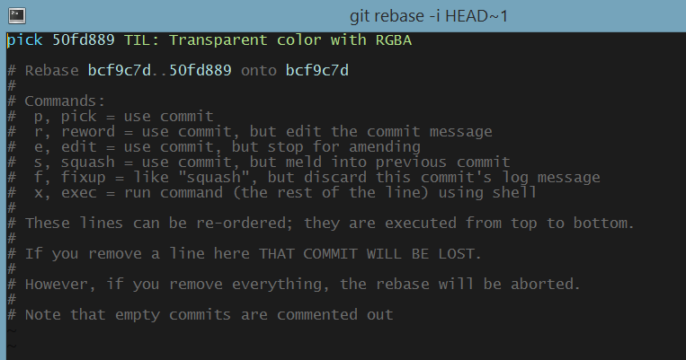

# Change commits after pushed to repository

To change a commit after it has been pushed to repository, `git rebase` is the correct tool.

Firstly, grap the commit hash of the commit you want to edit, then enter this command

```bash
git rebase -i commit_hash
```

This command will return a nano console where you have to pick the action you want to do with the specific commits



Change the `pick` action to the one you want to do (`edit`, `reword`, ...)

Save the file using `:wq`, now you can edit the commit as you want

Finally, force push everything onto the respository:

```bash
git push --force origin BRANCH
```

Volla!
